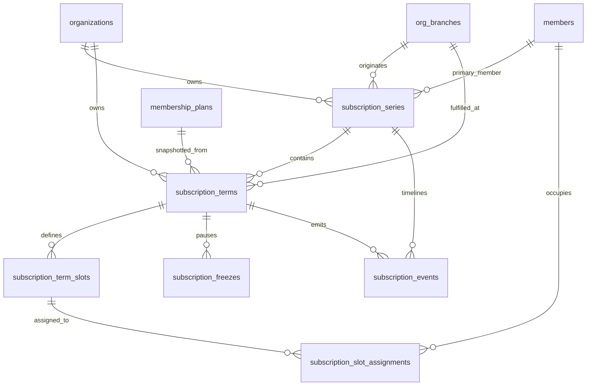
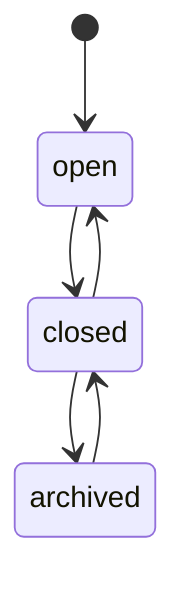
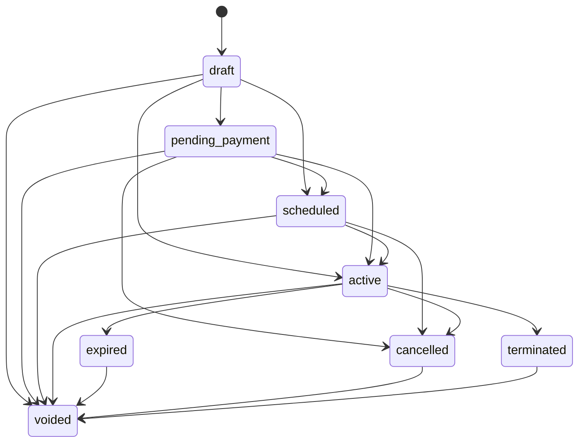

# Subscription Lifecycle Phase 1 Domain Design

Date: 2026-06-15

## 1. Executive Summary

Phase 1 defines the target subscription lifecycle model for Doers SaaS without changing production code, migrations, API routes, or frontend files.

The current modern subscription implementation stores each admission as a flat row in `member_subscriptions_v2`. That row is closer to a subscription term than a real subscription lifecycle. Renewal, freeze, archive, and member-slot history require a parent-and-term model:

- `subscription_series`: the long-lived operational subscription identity.
- `subscription_terms`: each admission, renewal, reactivation, or future scheduled entitlement period.
- `subscription_term_slots`: capacity slots promised by a term.
- `subscription_slot_assignments`: historical member occupancy of those slots.
- `subscription_freezes`: modern freeze/resume history.
- `subscription_events`: append-only lifecycle timeline.
- operation idempotency: replay protection for create, renew, freeze, resume, archive, and restore.

The design is additive and conservative. Existing modern records must be preserved first. Apparent renewal pairs such as adjacent records for the same member must not be automatically merged unless explicit lineage or product-owner confirmation exists.

No Phase 2 implementation should start until the existing unrelated worktree changes are committed or otherwise isolated.

## 2. Confirmed Current-State Constraints

### Worktree Safety Snapshot

Required safety commands were run before this document was added.

`git status --short`:

```text
 M app/models/member.py
 M app/repositories/member_repo.py
 M app/routers/members.py
 M app/schemas/member.py
 M app/services/member_service.py
 M tests/test_member_subscriptions_v2.py
 M tests/test_members.py
?? alembic/versions/b1c2d3e4f5a6_add_member_numbers.py
?? docs/subscription-lifecycle-phase-0-audit.md
```

`git diff --stat`:

```text
 app/models/member.py                  |   7 +-
 app/repositories/member_repo.py       |  95 +++++++++++--
 app/routers/members.py                |   8 +-
 app/schemas/member.py                 |   5 +
 app/services/member_service.py        |  34 ++++-
 tests/test_member_subscriptions_v2.py |   9 +-
 tests/test_members.py                 | 253 ++++++++++++++++++++++++++++++++++
 7 files changed, 387 insertions(+), 24 deletions(-)
```

`git diff --name-only`:

```text
app/models/member.py
app/repositories/member_repo.py
app/routers/members.py
app/schemas/member.py
app/services/member_service.py
tests/test_member_subscriptions_v2.py
tests/test_members.py
```

Pre-existing modified files are member-profile/member-number related and must not be mixed with subscription lifecycle schema work. Untracked Phase 0 audit and member-number migration are also pre-existing. This Phase 1 document is the only intended new file for this phase.

### Current Backend Constraints

Current modern tables:

- `member_subscriptions_v2`
- `subscription_members`

Current modern endpoints:

- `POST /organizations/{org_id}/member-subscriptions`
- `GET /organizations/{org_id}/member-subscriptions`
- `GET /organizations/{org_id}/member-subscriptions/{subscription_id}`

Current modern behavior:

- each create produces one independent flat subscription row
- one primary slot is created
- plan price, currency, duration, and capacity are snapshotted
- active/frozen duplicate primary subscriptions are blocked
- no parent lifecycle identity exists
- no renewal lineage exists
- no modern freeze history exists
- no modern payment/invoice link exists
- no operation idempotency exists for subscription actions

Legacy subscription and payment tables are gym-scoped and must remain isolated from the modern org-scoped subscription lifecycle.

## 3. Domain Terminology

- Subscription series: The long-lived commercial relationship for a member or group. It survives renewals and contains all terms.
- Subscription term: A dated entitlement period under a series. Admissions and renewals create terms.
- Current term: The term that currently grants entitlement, derived from status and validity dates.
- Upcoming term: A scheduled future term that has not started yet.
- Historical term: An expired, cancelled, terminated, or voided term retained for audit and reporting.
- Slot: A capacity position inside a term, based on the plan snapshot.
- Slot assignment: A dated history record showing which member occupied a slot.
- Primary member: The member who owns the series operationally.
- Freeze: A dated temporary access hold for a term.
- Renewal: Creation of a new term linked to a previous term in the same series.
- Archive: Hides a closed series from normal operational views without deleting history.
- Void: Administrative reversal of an invalid term, requiring high-risk permission and audit.

## 4. Entity Relationship Design



The key split is:

- `subscription_series` answers "what relationship is this?"
- `subscription_terms` answers "what exact dated entitlement was sold or scheduled?"
- slots and assignments answer "who was covered, and when?"
- freezes answer "when was access paused, and how was expiry affected?"
- events answer "what happened, who did it, and why?"

## 5. Proposed Tables And Important Columns

### `subscription_series`

Parent lifecycle record.

Important columns:

- `id uuid primary key`
- `org_id uuid not null references organizations(id) on delete restrict`
- `series_code text not null`
- `primary_member_id uuid not null references members(id) on delete restrict`
- `originating_branch_id uuid references org_branches(id) on delete restrict`
- `status subscription_series_status not null`
- `opened_on date not null`
- `closed_on date null`
- `archived_at timestamptz null`
- `archive_reason text null`
- `metadata jsonb not null default '{}'`
- `created_by uuid null`
- `updated_by uuid null`
- `created_at timestamptz not null`
- `updated_at timestamptz not null`
- `version integer not null default 1`

Recommended statuses:

- `open`
- `closed`
- `archived`

`originating_branch_id` is immutable after creation. Operational branch lives on each term.

### `subscription_terms`

Term-level entitlement record. This is the true replacement for `member_subscriptions_v2`.

Important columns:

- `id uuid primary key`
- `org_id uuid not null references organizations(id) on delete restrict`
- `series_id uuid not null references subscription_series(id) on delete restrict`
- `branch_id uuid not null references org_branches(id) on delete restrict`
- `membership_plan_id uuid references membership_plans(id) on delete restrict`
- `term_sequence integer not null`
- `term_code text not null`
- `renewed_from_term_id uuid null references subscription_terms(id) on delete restrict`
- `source_type subscription_term_source not null`
- `status subscription_term_status not null`
- `starts_on date not null`
- `ends_on date not null`
- `activated_at timestamptz null`
- `expired_at timestamptz null`
- `cancelled_at timestamptz null`
- `terminated_at timestamptz null`
- `voided_at timestamptz null`
- `price_snapshot numeric(12,2) not null`
- `currency_code text not null`
- `duration_value_snapshot integer not null`
- `duration_unit_snapshot text not null`
- `max_members_snapshot integer not null`
- `plan_name_snapshot text not null`
- `plan_type_snapshot text null`
- `legacy_member_subscription_v2_id uuid null`
- `created_by uuid null`
- `updated_by uuid null`
- `created_at timestamptz not null`
- `updated_at timestamptz not null`
- `version integer not null default 1`

Recommended statuses:

- `draft`
- `pending_payment`
- `scheduled`
- `active`
- `expired`
- `cancelled`
- `terminated`
- `voided`

Recommended sources:

- `admission`
- `renewal`
- `migration`
- `admin_adjustment`

Do not store `frozen` as a durable term status. Frozen access is derived from active freeze windows. A read model may expose `effective_status = frozen`.

### `subscription_term_slots`

Capacity slots promised by a term.

Important columns:

- `id uuid primary key`
- `org_id uuid not null`
- `term_id uuid not null references subscription_terms(id) on delete restrict`
- `slot_number integer not null`
- `role subscription_slot_role not null`
- `is_primary boolean not null default false`
- `created_at timestamptz not null`
- `updated_at timestamptz not null`

Recommended roles:

- `primary`
- `partner`
- `dependent`
- `family_member`
- `corporate_member`
- `standard`

### `subscription_slot_assignments`

Historical member occupancy per slot.

Important columns:

- `id uuid primary key`
- `org_id uuid not null`
- `term_id uuid not null references subscription_terms(id) on delete restrict`
- `slot_id uuid not null references subscription_term_slots(id) on delete restrict`
- `member_id uuid not null references members(id) on delete restrict`
- `assigned_from date not null`
- `assigned_until date null`
- `assignment_reason text null`
- `released_reason text null`
- `created_by uuid null`
- `released_by uuid null`
- `created_at timestamptz not null`
- `updated_at timestamptz not null`

This table replaces current-slot-only semantics and gives audit-grade history.

### `subscription_freezes`

Modern freeze history.

Important columns:

- `id uuid primary key`
- `org_id uuid not null`
- `series_id uuid not null references subscription_series(id) on delete restrict`
- `term_id uuid not null references subscription_terms(id) on delete restrict`
- `status subscription_freeze_status not null`
- `freeze_starts_on date not null`
- `freeze_ends_on date null`
- `actual_resumed_on date null`
- `extension_days integer not null default 0`
- `reason text null`
- `resume_reason text null`
- `created_by uuid null`
- `resumed_by uuid null`
- `cancelled_by uuid null`
- `created_at timestamptz not null`
- `updated_at timestamptz not null`

Recommended statuses:

- `scheduled`
- `active`
- `completed`
- `cancelled`

### `subscription_events`

Append-only lifecycle timeline.

Important columns:

- `id uuid primary key`
- `org_id uuid not null`
- `series_id uuid not null references subscription_series(id) on delete restrict`
- `term_id uuid null references subscription_terms(id) on delete restrict`
- `event_type subscription_event_type not null`
- `actor_user_id uuid null`
- `occurred_at timestamptz not null`
- `reason text null`
- `metadata jsonb not null default '{}'`
- `request_id text null`
- `idempotency_key text null`

Initial event types:

- `series_opened`
- `admission_created`
- `term_scheduled`
- `term_activated`
- `renewal_created`
- `renewal_scheduled`
- `term_expired`
- `term_cancelled`
- `term_terminated`
- `term_voided`
- `freeze_scheduled`
- `freeze_started`
- `freeze_resumed`
- `freeze_cancelled`
- `series_closed`
- `series_archived`
- `series_restored`
- `slot_assigned`
- `slot_released`

## 6. State Machines

### Series State Machine



Rules:

- `open`: can hold active, scheduled, or historical terms.
- `closed`: no active or scheduled terms remain; can be reopened by renewal/reactivation.
- `archived`: hidden from normal operational views; history remains immutable.
- restoring archived series returns it to `closed`, not automatically `open`.

### Term State Machine



Important rules:

- `expired -> active` is forbidden.
- Renewal creates a new term; it does not mutate an expired term back to active.
- Freeze does not change stored term status; it creates a freeze record and changes effective access.
- `voided` is high-risk administrative correction only.

### Effective Access Status

Displayed status should be derived:

- `scheduled`: term starts in the future.
- `active`: term status is active, today is within the term dates, and no active freeze applies.
- `frozen`: term status is active, today is within dates, and an active freeze applies.
- `expired`: stored expired or active term whose end date is before today and has not yet been reconciled.
- `cancelled`, `terminated`, `voided`: stored terminal statuses.

## 7. Validity And Date Semantics

Decision: store inclusive `starts_on` and inclusive `ends_on`.

Examples:

- term displayed as `15 Jun 2026 - 15 Sep 2026` grants access through 15 Sep 2026.
- the next continuous renewal starts on 16 Sep 2026.
- if a term ends on 14 Jun 2026, it is expired on 15 Jun 2026.

For database overlap checks, convert inclusive dates to half-open ranges:

```sql
daterange(starts_on, ends_on + 1, '[)')
```

This avoids off-by-one overlap bugs while preserving business-friendly inclusive display.

Month arithmetic should use calendar-add semantics with last-day clamping:

- Jan 31 + 1 month = Feb 28 or Feb 29
- Feb 29 + 1 year = Feb 28 unless product chooses anniversary preservation differently

Time zone:

- Store lifecycle dates as `date`.
- Evaluate "today" using the organization or branch business timezone.
- Store event times as `timestamptz`.

## 8. Renewal Model

Renewal creates a new `subscription_terms` row in the same `subscription_series`.

Required renewal inputs:

- source term id
- branch id
- membership plan id
- renewal start date
- optional payment policy placeholder
- idempotency key

Renewal output:

- same `series_id`
- new `term_sequence`
- new `term_code`
- `renewed_from_term_id` set to source term
- plan snapshots copied from the selected plan at renewal time
- capacity slots generated from the new max-member snapshot
- primary member assignment created automatically
- `renewal_created` or `renewal_scheduled` event emitted

Allowed renewal sources:

- active term: creates a future scheduled term unless the product explicitly allows immediate plan change.
- expired term: creates a new active or scheduled term.
- cancelled/terminated term: requires manager permission and should be classified as reactivation.
- voided term: not renewable.

Conservative rule:

- do not infer renewal lineage from same member and adjacent dates during migration.
- only explicit renewal operations or confirmed reconciliation should set `renewed_from_term_id`.

## 9. Slot And Assignment Model

Slots represent purchased capacity for a term. Assignments represent who occupied that capacity and when.

Rules:

- slot count is generated from `max_members_snapshot`.
- every active term must have exactly one primary slot assignment for the primary member at activation.
- a slot can have multiple assignments over time, but assignment ranges for the same slot cannot overlap.
- assignment date ranges must fit inside the term date range.
- releasing a member sets `assigned_until`; it does not delete the assignment.
- member replacement mid-term is allowed only if product policy permits it.

Member overlap:

- default: prevent the same member from having overlapping active assignments in two active/scheduled terms inside the same organization.
- allow an organization-level override later for special services if product confirms multi-service subscriptions.
- implement hard slot-overlap constraints in the database first; implement member-overlap as service validation plus optional exclusion constraints once policy is confirmed.

## 10. Freeze Model

Freeze is a first-class history record, not a status rewrite.

Rules:

- future freeze is allowed with status `scheduled`.
- an active freeze disables access for assigned members in that term.
- freezes cannot overlap for the same term.
- freezing an already expired, cancelled, terminated, or voided term is forbidden.
- resume closes the active freeze and records actual resumed date.
- freeze extension policy should live in subscription policy/config, not be hardcoded in the table.

Recommended default extension policy:

- freeze extends `ends_on` by the number of frozen calendar days.
- extension is stored as `extension_days` and an event metadata snapshot.
- extension creates an audit event and should update the term dates inside the same transaction.

If product later chooses "freeze does not extend expiry", keep `extension_days = 0` and only use freeze for access blocking.

## 11. Audit And Idempotency Model

### Audit

Use append-only `subscription_events` for subscription timeline. Integrate with existing audit/outbox infrastructure in implementation phases.

Events should include:

- actor
- request id
- idempotency key
- before/after summary where safe
- reason
- branch and plan context

Audit events are required for:

- admission
- renewal
- freeze/resume/cancel freeze
- cancel/terminate/void
- archive/restore
- slot assignment/release
- branch change
- payment state changes once modern payments exist

### Idempotency

Use the existing global idempotency infrastructure where possible, but add a subscription-domain operation record if response replay/resource lookup needs stronger guarantees.

Recommended table: `subscription_operation_idempotency`.

Important columns:

- `id uuid primary key`
- `org_id uuid not null`
- `operation_name text not null`
- `idempotency_key text not null`
- `request_hash text not null`
- `status text not null`
- `result_resource_type text null`
- `result_resource_id uuid null`
- `response_snapshot jsonb null`
- `error_code text null`
- `expires_at timestamptz not null`
- `created_at timestamptz not null`
- `completed_at timestamptz null`

Behavior:

- same key and same request hash returns the previous result.
- same key and different request hash returns structured conflict.
- in-progress key returns retryable conflict.
- completed failed requests can be replayed according to operation policy.
- retain records for at least 24 hours; 7 to 30 days is safer for branch operations and unreliable networks.

## 12. Database Constraints

Core constraints:

- unique `(org_id, series_code)` on `subscription_series`
- unique `(org_id, term_code)` on `subscription_terms`
- unique `(series_id, term_sequence)` on `subscription_terms`
- unique nullable `legacy_member_subscription_v2_id` on `subscription_terms`
- check `ends_on >= starts_on`
- check `term_sequence > 0`
- check `price_snapshot >= 0`
- check `duration_value_snapshot > 0`
- check `max_members_snapshot > 0`
- unique `(term_id, slot_number)` on `subscription_term_slots`
- unique primary slot per term
- assignment ranges fit inside term range
- no overlapping assignments for one slot
- no overlapping scheduled/active terms in one series
- optional member-overlap guard based on product policy

Recommended PostgreSQL exclusion for term overlap:

```sql
EXCLUDE USING gist (
  series_id WITH =,
  daterange(starts_on, ends_on + 1, '[)') WITH &&
)
WHERE (status IN ('scheduled', 'active', 'pending_payment'));
```

If unpaid terms should not reserve access or renewal space, remove `pending_payment` from the exclusion predicate.

Renewal lineage constraints:

- `renewed_from_term_id` cannot equal `id`.
- renewed-from term must belong to same org and series.
- only one active/scheduled renewal child should exist for a source term.

Tenant isolation:

- every lifecycle table carries `org_id`.
- service and repository queries must always filter by `org_id`.
- composite foreign keys or triggers should assert same-org ownership across series, terms, slots, assignments, freezes, branches, plans, and members.
- future RLS policies should mirror the existing branch/contact RLS direction.

Deletion policy:

- use `ON DELETE RESTRICT` for historical lifecycle references.
- never cascade-delete subscription history from members, branches, plans, or organizations in production.
- local/dev cleanup can use explicit destructive scripts only outside app flows.

## 13. Current-Term Resolution

Do not store `current_term_id` in Phase 2 schema.

Calculate current term from terms:

1. Prefer active term where `starts_on <= today <= ends_on`.
2. If an active freeze window covers today, expose `effective_status = frozen`.
3. If no active current term exists, find the nearest future scheduled term.
4. If no future term exists, expose last historical term.
5. If stored status is stale, read model can expose derived expired while a reconciliation job updates stored status.

Optional later optimization:

- add a read-model/projection table or cached `current_term_id` after behavior stabilizes.
- never make the cached value the source of truth.

## 14. Archiving And Retention

Archive is not deletion.

Rules:

- only closed series can be archived.
- active or scheduled terms block archive.
- archived series appear only in archived/all administrative views.
- restore moves `archived -> closed`.
- restore does not recreate access or reopen terms.
- archived series and terms remain available to audit, reporting, and future payment reconciliation.

Retention:

- subscription history is retained indefinitely unless a formal data-retention/privacy policy later requires anonymization.
- member deletion should be soft deletion or anonymization, not FK deletion.

## 15. Legacy-System Boundary

Legacy gym-scoped tables remain isolated:

- `subscription_plans`
- `member_subscriptions`
- `member_freeze_logs`
- `payments`
- `invoices`

Do not retrofit modern lifecycle behavior into legacy tables.

Modern payment work should create new org-scoped payment/invoice/linkage tables or explicit adapter tables that reference `subscription_terms`, not legacy `member_subscriptions`.

`member_subscriptions_v2` should become a compatibility source during migration, not the final lifecycle table.

## 16. Migration And Backfill Blueprint

Phase 2 migration should be additive:

1. Create new enums.
2. Create `subscription_series`.
3. Create `subscription_terms`.
4. Create `subscription_term_slots`.
5. Create `subscription_slot_assignments`.
6. Create `subscription_freezes`.
7. Create `subscription_events`.
8. Add operation idempotency if not fully covered by existing infrastructure.
9. Add indexes and constraints after safe backfill where needed.

Backfill strategy:

- create one `subscription_series` per existing `member_subscriptions_v2` row by default.
- create one `subscription_terms` row per existing `member_subscriptions_v2` row.
- set `source_type = migration`.
- preserve existing `subscription_code` as `term_code` or `legacy_term_code`.
- generate deterministic `series_code` from the old code, for example `SER-{subscription_code}` or a new org counter.
- copy branch, plan, primary member, dates, status, and snapshots exactly.
- create term slots from `max_members_snapshot`.
- convert each existing `subscription_members` row into a slot and assignment history row.
- set `legacy_member_subscription_v2_id` for traceability.
- emit migration audit events only if the event table is intended to contain system migration events.

Conservative lineage:

- do not join `SUB-FITTY-001` and `SUB-FITTY-003` solely because they look related.
- produce a review report for same-member, same-branch, adjacent-date candidates.
- apply lineage later through a controlled reconciliation operation.

Compatibility:

- keep existing `/member-subscriptions` endpoints alive during migration.
- initially implement them as adapters over new terms or continue reading old rows until parity is proven.
- never drop `member_subscriptions_v2` in the same phase as adding lifecycle tables.

## 17. API Compatibility Plan

Keep current endpoints:

- `POST /organizations/{org_id}/member-subscriptions`
- `GET /organizations/{org_id}/member-subscriptions`
- `GET /organizations/{org_id}/member-subscriptions/{subscription_id}`

Add future lifecycle endpoints under org scope:

- `GET /organizations/{org_id}/subscriptions`
- `GET /organizations/{org_id}/subscriptions/{series_id}`
- `GET /organizations/{org_id}/subscriptions/{series_id}/timeline`
- `POST /organizations/{org_id}/subscriptions/{series_id}/renewals`
- `POST /organizations/{org_id}/subscription-terms/{term_id}/freezes`
- `POST /organizations/{org_id}/subscription-freezes/{freeze_id}/resume`
- `POST /organizations/{org_id}/subscription-series/{series_id}/archive`
- `POST /organizations/{org_id}/subscription-series/{series_id}/restore`

Recommended list views:

- current: one row per operational series with current/effective term summary.
- upcoming: scheduled admissions and renewals.
- history: expired/cancelled/terminated/voided terms.
- archived: archived closed series.
- all: administrative flat term-level records.

All mutation endpoints should:

- require `Idempotency-Key`
- validate request hash on replay
- return structured conflict errors
- return `available_actions` in read responses
- include `x-request-id` correlation

Structured conflict examples:

- `subscription.term_overlap`
- `subscription.renewal_exists`
- `subscription.series_archived`
- `subscription.term_not_renewable`
- `subscription.member_overlap`
- `subscription.freeze_overlap`
- `subscription.idempotency_conflict`

## 18. Frontend Read Models

### Series Summary

```ts
type SubscriptionSeriesSummary = {
  id: string;
  seriesCode: string;
  status: 'open' | 'closed' | 'archived';
  primaryMember: MemberSummary;
  originatingBranch: BranchSummary | null;
  currentTerm: SubscriptionTermSummary | null;
  scheduledTerm: SubscriptionTermSummary | null;
  previousTermCount: number;
  capacity: MemberCapacitySummary;
  availableActions: AvailableAction[];
  payment: PaymentPlaceholder | null;
};
```

### Term Summary

```ts
type SubscriptionTermSummary = {
  id: string;
  termCode: string;
  termSequence: number;
  status: string;
  effectiveStatus: string;
  planName: string;
  branchName: string;
  startsOn: string;
  endsOn: string;
  price: number;
  currencyCode: string;
  renewedFromTermId?: string | null;
};
```

### Capacity Summary

```ts
type MemberCapacitySummary = {
  used: number;
  total: number;
  primaryMemberId: string;
  activeAssignments: Array<{
    memberId: string;
    memberNumber?: number;
    name: string;
    slotNumber: number;
    role: string;
  }>;
};
```

### Available Action

```ts
type AvailableAction = {
  action: 'renew' | 'freeze' | 'resume' | 'cancel' | 'terminate' | 'archive' | 'restore' | 'void';
  enabled: boolean;
  reasonCode?: string;
  label: string;
};
```

### Timeline Event

```ts
type SubscriptionTimelineEvent = {
  id: string;
  type: string;
  occurredAt: string;
  actorName?: string | null;
  termId?: string | null;
  message: string;
  metadata?: Record<string, unknown>;
};
```

### View Behavior

Current view:

- one row per open series with current effective term.
- default status is active/effective-current.
- default branch is current branch.

Upcoming view:

- scheduled renewals and future admissions.

History view:

- expired, cancelled, terminated, and voided terms.

Archived view:

- archived closed series only.

All Records:

- flat term-level administrative table.

Known example target display:

```text
Current:
Muralidharan S
Current term 2
Active
Previous terms: 1

History:
Term 1
Expired
Renewed into term 2
```

Immediate conservative migration display:

```text
Current:
Muralidharan S
Current term 1
Active
Previous terms: 0

History:
Earlier same-member term appears as separate migrated series unless reconciled.
```

After manual or evidence-based reconciliation, the desired display becomes available.

## 19. Authorization Model

Normal operational permissions:

- `subscription.view`
- `subscription.create`
- `subscription.renew`
- `subscription.freeze`
- `subscription.resume`
- `subscription.view_audit`

Manager-level permissions:

- `subscription.cancel`
- `subscription.terminate`
- `subscription.change_branch`
- `subscription.apply_discount`
- `subscription.archive`
- `subscription.restore`

High-risk administrative permissions:

- `subscription.void`
- `subscription.backdate`
- `subscription.override_overlap`
- `subscription.reconcile_lineage`
- `subscription.modify_snapshots`

Default mapping:

- owner/admin: all permissions.
- branch manager: normal plus manager-level within assigned branches.
- staff: view/create/renew only if business policy allows.
- accountant/payment role later: payment-linked actions, not lifecycle override by default.

## 20. Concurrency Strategy

Use multiple layers:

- `SELECT ... FOR UPDATE` on the series and source term for lifecycle mutations.
- PostgreSQL advisory locks for high-level org/series operations using a new subscription lock namespace.
- optimistic `version` columns for UI edit conflict detection.
- unique/exclusion constraints for final database protection.
- idempotency keys for retry/double-click safety.

### Renewal Transaction Sequence

1. Start transaction.
2. Validate and reserve idempotency key.
3. Acquire advisory lock for `(org_id, series_id)`.
4. `SELECT ... FOR UPDATE` the series.
5. `SELECT ... FOR UPDATE` source term.
6. Recompute effective source status using dates and freezes.
7. Validate source is renewable and series is not archived.
8. Lock or validate conflicting scheduled/active terms.
9. Validate branch, plan, primary member, and slot policy.
10. Snapshot selected plan.
11. Allocate next term sequence and term code atomically.
12. Insert new term with `renewed_from_term_id`.
13. Insert term slots and primary assignment.
14. Insert subscription event.
15. Store idempotency response snapshot.
16. Commit.

This prevents:

- double-click duplicates
- two employees renewing simultaneously
- freeze racing with renewal
- expiry reconciliation racing with renewal
- scheduled renewal overlap
- partial term/slot creation

Freeze, resume, cancel, archive, and slot assignment should follow the same pattern: idempotency, series lock, target row lock, validation, insert/update, event, commit.

## 21. Testing Strategy

### Phase 2 Tests

Migration tests:

- fresh database builds from Alembic head.
- migration preserves existing `member_subscriptions_v2` data.
- one series and one term are created per existing flat row.
- slot rows and assignments are created from `subscription_members`.
- no inferred lineage is created automatically.

Constraint tests:

- cannot create overlapping active terms in one series.
- cannot create duplicate term sequence.
- cannot create duplicate series code per org.
- cannot create duplicate term code per org.
- cannot assign overlapping members to one slot.
- cannot violate same-org ownership.

Tenant isolation tests:

- org A cannot read org B series, terms, slots, assignments, freezes, or events.
- branch and plan must belong to the same org.

Compatibility tests:

- old list endpoint still returns expected flat response.
- old create endpoint still works through adapter or old table.
- frontend build remains compatible with existing data layer until new data layer is added.

### Phase 3 Tests

State-transition tests:

- scheduled activates when date arrives.
- active expires after end date.
- expired cannot return to active directly.
- void requires admin permission.

Renewal tests:

- active renewal creates scheduled term.
- expired renewal creates new active or scheduled term.
- duplicate idempotency key replays result.
- two concurrent renewals create only one child term.
- renewal snapshots new plan values.

Multi-member slot tests:

- family plan creates expected slots.
- assignment history preserves replacement.
- member overlap policy is enforced.

Freeze tests:

- future freeze can be scheduled.
- active freeze blocks access.
- overlapping freeze rejected.
- resume records actual resumed date.
- extension policy updates end date when enabled.

Archive tests:

- active series cannot be archived.
- closed series can be archived.
- restore returns to closed only.

Reporting-count tests:

- current counts one row per operational series.
- history counts terms.
- active members count uses slot assignments and effective access.

Frontend tests:

- Current, Upcoming, History, Archived, and All views render correct rows.
- Renew action opens prefilled modal for series/term.
- unavailable actions show reason.
- structured conflicts render actionable messages.

## 22. Decision Register

### 1. Final Parent-Table Name

- Decision: `subscription_series`
- Alternatives: `subscriptions`, `member_subscription_series`
- Reason: clear lifecycle parent without colliding with existing flat/legacy names.
- Consequence: frontend can show one operational row per series.
- Migration impact: additive table.
- Open question: none.

### 2. Final Term-Table Strategy

- Decision: create `subscription_terms`.
- Alternatives: mutate `member_subscriptions_v2`.
- Reason: safer additive migration and clearer semantics.
- Consequence: adapter needed for old endpoints.
- Migration impact: backfill one term per existing v2 row.
- Open question: none.

### 3. `member_subscriptions_v2` Future

- Decision: keep as compatibility/source table initially, not final domain table.
- Alternatives: rename it into `subscription_terms`.
- Reason: current worktree and data are live; additive migration avoids destructive risk.
- Consequence: temporary duplication/adapter complexity.
- Migration impact: future deprecation phase required.
- Open question: when to retire the old endpoint.

### 4. Current Term Storage

- Decision: calculate current term; do not store `current_term_id` initially.
- Alternatives: cached FK on series.
- Reason: avoids stale circular reference and migration complexity.
- Consequence: query/read-model complexity.
- Migration impact: none initially.
- Open question: whether performance later requires projection.

### 5. Validity Dates

- Decision: inclusive `starts_on` and inclusive `ends_on`.
- Alternatives: half-open business dates.
- Reason: matches current UI/product language.
- Consequence: DB overlap checks must convert to half-open ranges.
- Migration impact: preserve existing dates exactly.
- Open question: confirm with product owner before payment proration work.

### 6. Branch Ownership Model

- Decision: series has immutable originating branch; terms have operational branch.
- Alternatives: branch only on series or branch only on term.
- Reason: renewals may move branch while preserving historical origin.
- Consequence: branch filtering must clarify current-term branch vs origin branch.
- Migration impact: copy current branch to both during backfill.
- Open question: can renewal change branch without manager approval?

### 7. Series Code And Term Code

- Decision: series and terms each have unique org-scoped codes.
- Alternatives: only series code with sequence suffix.
- Reason: invoices/support need term-specific reference.
- Consequence: code generator needs separate counters.
- Migration impact: old subscription code can become term code; series code generated.
- Open question: desired human-readable format.

### 8. Freeze Extension Policy

- Decision: policy/config controls whether freeze extends expiry; default yes.
- Alternatives: hardcode extension or no extension.
- Reason: gyms vary by business policy.
- Consequence: freeze service must snapshot policy on event.
- Migration impact: no existing modern freeze rows.
- Open question: confirm default freeze behavior.

### 9. Member-Overlap Enforcement

- Decision: enforce slot overlap in DB; enforce member overlap in service initially.
- Alternatives: hard DB exclusion for member overlap from day one.
- Reason: product may allow simultaneous service subscriptions.
- Consequence: stronger DB rule can be added after policy confirmation.
- Migration impact: safer backfill.
- Open question: can one member hold two simultaneous service subscriptions?

### 10. Conservative Backfill

- Decision: one series per existing v2 row unless explicit lineage exists.
- Alternatives: infer lineage by member/date adjacency.
- Reason: avoids corrupting history.
- Consequence: manual reconciliation may be needed.
- Migration impact: generates review report for candidates.
- Open question: owner approval for specific reconciliation batches.

### 11. Legacy-System Boundary

- Decision: legacy subscription/payment tables remain isolated.
- Alternatives: reuse legacy payment/invoice FKs.
- Reason: legacy is gym-scoped and conflicts with org-scoped model.
- Consequence: modern payments need new design.
- Migration impact: none in lifecycle Phase 2.
- Open question: none.

### 12. Archive Restoration

- Decision: restore archived series to closed.
- Alternatives: restore to open/current.
- Reason: archive should not recreate entitlement.
- Consequence: user must explicitly renew/reactivate after restore.
- Migration impact: none.
- Open question: none.

### 13. Status Storage Mechanism

- Decision: PostgreSQL enums for initial lifecycle statuses.
- Alternatives: lookup tables or free text with checks.
- Reason: repository already uses enums and statuses are controlled.
- Consequence: adding statuses requires migrations.
- Migration impact: create new enums additively.
- Open question: none.

### 14. Idempotency Retention

- Decision: retain operation idempotency records for 7 to 30 days.
- Alternatives: 24 hours only or permanent retention.
- Reason: balances retry safety and storage.
- Consequence: cleanup job required.
- Migration impact: additive table or use existing store plus domain reference.
- Open question: exact retention period.

### 15. Event Audit Scope

- Decision: subscription lifecycle events are append-only and product-visible.
- Alternatives: only internal audit logs.
- Reason: timeline UX and support investigations need domain-readable history.
- Consequence: event message design matters.
- Migration impact: optional migration events can be inserted.
- Open question: whether migration events should be visible to gym admins.

### 16. API Compatibility Strategy

- Decision: keep existing `/member-subscriptions` endpoints and add lifecycle endpoints.
- Alternatives: replace current endpoints immediately.
- Reason: safer frontend/backend rollout.
- Consequence: temporary adapter maintenance.
- Migration impact: no immediate breaking API change.
- Open question: removal timeline for compatibility endpoint.

## 23. Product-Owner Questions

1. Can a member hold two simultaneous service subscriptions?
   - Why it matters: determines member-overlap DB constraints.
   - Recommended default: no overlapping access subscriptions.
   - Different choice: service validation and reporting must support multiple active entitlements.

2. Does freezing extend expiry?
   - Why it matters: affects renewal dates, revenue recognition, and access.
   - Recommended default: yes, freeze extends by frozen calendar days.
   - Different choice: access pauses but revenue period does not extend.

3. How many freeze periods are allowed per term?
   - Why it matters: policy validation and UI limits.
   - Recommended default: configurable, initially unlimited with manager oversight.
   - Different choice: enforce count/duration caps.

4. Can a renewal change branch?
   - Why it matters: term branch ownership and manager permission.
   - Recommended default: yes with manager permission.
   - Different choice: branch transfers require cancellation/reactivation.

5. When does a long gap become re-enrolment rather than renewal?
   - Why it matters: lineage, reporting, offers, and admission fee policy.
   - Recommended default: renewal keeps lineage regardless of gap unless staff selects re-enrolment.
   - Different choice: automatic cutoff rule needed.

6. Can unpaid terms activate?
   - Why it matters: `pending_payment` overlap and access rules.
   - Recommended default: no; unpaid terms remain pending/scheduled without access.
   - Different choice: payment module must handle receivables and debt state.

7. Should family-slot members be replaceable mid-term?
   - Why it matters: assignment history and fraud/access rules.
   - Recommended default: manager-approved replacement with audit.
   - Different choice: slots fixed for full term.

8. Should migrated system events be visible to gym admins?
   - Why it matters: timeline clarity after backfill.
   - Recommended default: hide technical migration events from normal timeline, keep audit internally.
   - Different choice: admins see a "Imported from previous system" event.

## 24. Phase 2 Implementation Sequence

1. Commit or isolate existing unrelated backend/frontend changes.
2. Add new enums and tables in an additive Alembic migration.
3. Add ORM models only for new lifecycle tables.
4. Add repository methods for series/term creation and read models.
5. Add migration/backfill scripts with conservative one-row-to-one-series mapping.
6. Add compatibility adapters for current `/member-subscriptions` reads.
7. Add service tests for constraints and tenant isolation.
8. Add API read endpoints for current/upcoming/history/all behind existing auth.
9. Add renewal service only after schema and read model tests pass.
10. Add frontend data layer after backend contracts stabilize.

Do not build payments until subscription terms, lineage, idempotency, and current/history views are stable.

## 25. Risks And Rollback Considerations

Main risks:

- false lineage corrupting member history
- stale status if expiry reconciliation is not designed carefully
- old and new endpoints drifting during compatibility period
- branch transfer semantics affecting reports
- freeze extension policy changing financial expectations
- future payment design depending on term identity
- destructive cascades in old tables conflicting with historical retention

Rollback approach:

- Phase 2 must be additive.
- keep old tables and endpoints intact.
- feature-flag new lifecycle reads if needed.
- backfill should be repeatable in test and guarded in development.
- destructive cleanup/deprecation should be a later phase after production-like verification.

Phase 2 is safe to begin only after the current uncommitted member/subscription work is separated and committed, and after product-owner answers are accepted or defaulted explicitly.
